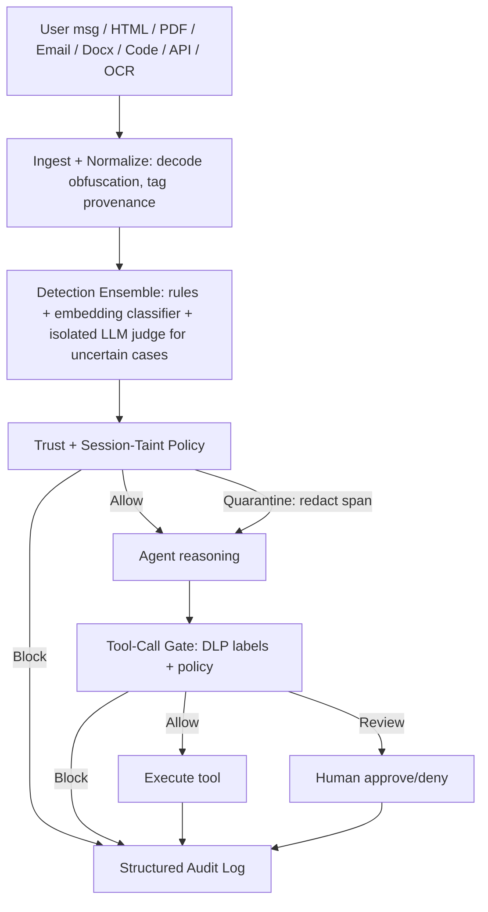

# Architecture

## Why 5 layers + a stateful layer

- **Ingest/Normalize**: an LLM cannot tell data from instructions. A PDF
  containing "ignore previous instructions" is just text to the model. This
  layer decodes obfuscation (base64/hex/ROT13/zero-width/homoglyphs) and
  tags where content came from (provenance) and how much it should be
  trusted.
- **Detection ensemble**: cheap rules run on everything; an embedding
  classifier adds a second cheap signal; an LLM judge is only invoked for
  the uncertain score band to control cost and latency. The judge is
  isolated — structured JSON output only, never given tool access, never
  treated as instructions.
- **Trust-aware policy**: the same risk score matters more coming from
  retrieved/external content than from the user directly — an imperative
  instruction inside a retrieved document is itself a red flag (indirect
  injection).
- **Tool-call gate**: the containment layer. Regardless of whether detection
  caught the attack, every sensitive tool call (send email, transfer funds,
  delete file) is checked against DLP labels + policy before execution.
  This is where Secret Extraction, Credential Theft and Tool Abuse are
  actually stopped, not by text scanning.
- **Audit log**: every decision (allow/quarantine/block, gate allow/review/
  block) is logged with a reason, attack type and evidence span for
  explainability.
- **Session taint tracker** (stateful): Context Poisoning and Multi-Step
  Jailbreaks don't look malicious in a single turn. Risk accumulates across
  a session; once tainted, the gate applies stricter policy to that turn's
  tool calls. This is approximate taint tracking, not exact data-lineage
  tracing (which isn't reliably possible inside an LLM pipeline).

## Positioning

**Agent Security Gateway**: packaged as a Python library (`pif_firewall`)
with a thin FastAPI wrapper (`service/`), so any agent framework can call it
either as a library or as a drop-in HTTP middleware.
